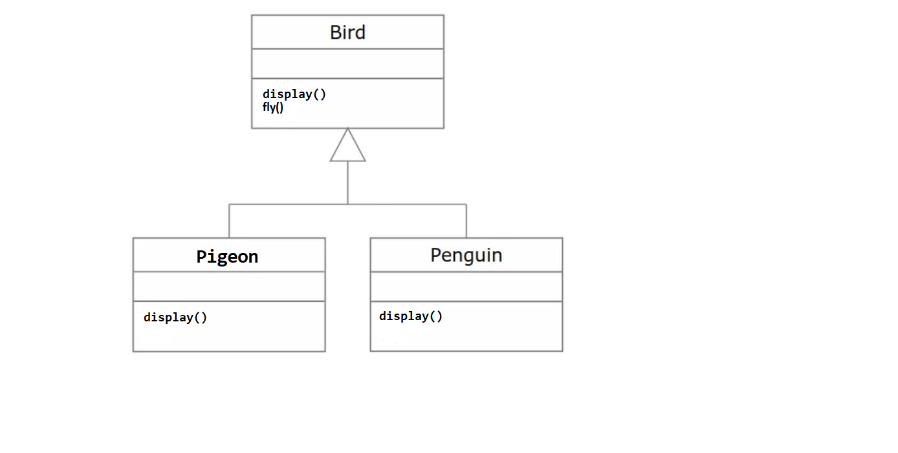
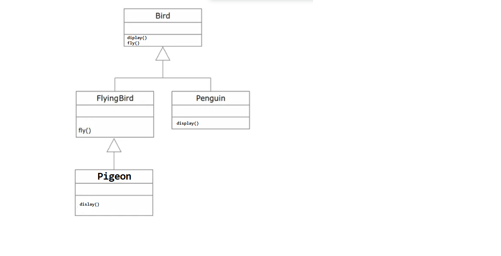

					# S.O.L.I.D PRINCIPLES #

Dans cet article, nous discuterons des **principes solides**, les principes SOLID sont l'ensemble des cinq principes utilisés pour concevoir un logiciel. En fait, le mot **SOLIDE** est l'acronyme de l'ensemble de cinq principes qui contient la première lettre de chaque principe.   
Les principes de conception aident les équipes à prendre des décisions, et avoir un produit beau.   
En respectant les principes SOLID, on évite les odeurs de code, avoir un code propre et maintenable et facile à tester.

# Le Principe De Responsabilité Unique - Single Responsibility Principle (SRP):   
Ce principe dit qu'il ne devrait jamais y avoir plus d'une raison pour qu'une classe change. Une classe doit être axée sur **une seule fonctionnalité**, répondre à une préoccupation spécifique. Cela signifie que chaque classe, ou structure similaire, dans votre code ne doit avoir qu'un seul travail à faire. Tout dans la classe doit être lié à cet objectif unique, c'est-à-dire être cohérent. Cela ne signifie pas que vos classes ne doivent contenir qu'une seule méthode ou propriété.     

Vous pouvez éviter ces problèmes en posant une question simple avant d'apporter des modifications, Quelle est la responsabilité de votre classe/composant/microservice ?   
Si votre réponse inclut le mot "et", vous viiler très probablement le principe de responsabilité unique.    
### Exemple qui viole le principe de Responsabilité Unique:   
Prenons cette classe employé:  

		public class Employee {
		
			public Double calculatePay() {
				// calculate pay employee
				return 0.0;
			}
		
		    public void saveEmployee() {
		    	// save employee
		    }
		
		    public void getEmployeeReport() {
		    	// fetch report employee
		    }
		}
Combien de responsabilités dans cette classe ?     
La bonne réponse est **trois**.   
Ici, nous avons une logique de **calcul**, une logique de **base de données** et une logique de **rapport**. Tout mélangé dans une même classe.      
Si vous avez plusieurs responsabilités combinées en une seule classe, il peut être difficile de changer une partie sans en casser d'autres.     
Le mélange des responsabilités rend également la classe plus difficile à comprendre et plus difficile à tester.     
### Solution:   
Le moyen le plus simple de résoudre ce problème consiste à diviser la classe en trois classes différentes, chacune n'ayant qu'une seule responsabilité : l'accès à la base de données, le calcul du paiement et la création de rapports, tous séparés.   

		public class EmployeePayment {
			public Double calculatePay() {
				// logic to calculate employee payment
				return 0.0;
			}
		}

		public class EmployeeRepository {
			public void saveEmployee() {
				// logic to save employee object
			}
		}

		public class EmployeeReport {
			public void getEmployeeReport() {
				// logic to generate employee report
			}
		}
### Un exemple de vie réelle:    
Vous pouvez trouver de nombreux exemples de Responsabilité Unique, en l'occurrence **L'  interface EntityManager** de JPA, fournit un ensemble de méthodes pour enregistrer, mettre à jour, supprimer et lire des entités d'une base de données relationnelle. Sa responsabilité est de gérer les entités qui sont associées au contexte de persistance actuel.          
### avantage du principe de responsabilité unique:  
# Le Principe Ouvert Fermé - The Open Closed Principle (OCP):   
Le principe dit: Les composants logiciels doivent être ouverts à l'extension, mais fermés à la modification ». En termes simples, les composants logiciels tels que les classes, les modules et les fonctions doivent être ouverts aux extensions mais fermés aux modifications.       
Bien sûr, la seule exception à la règle concerne la correction de bogues dans le code existant. Donc, nous ne devrions modifier notre classe qu'au moment de la correction des bogues.      
Il existe plusieurs manière pour étendre une classe:   
* Héritage de la classe.    
* Redéfinir les comportements requis de la classe.   
* Extension de certains comportements de la classe.    

### Exemple qui viole le Principe Ouvert Fermé OCP:    
Supposons que nous devions écrire un programme qui calcule l'aire de différentes formes. Nous commençons par créer une classe pour notre première forme, disons Rectangle qui a 2 attributs longueur et largeur.    
Ensuite, nous créons une classe pour calculer la surface de ce Rectangle qui a une méthode calculateRectangleArea() qui prend le Rectangle comme paramètre d'entrée:   

		public class AreaCalculator {
			public Double calculateRectangleArea(Rectangle rectangle) {
				return rectangle.length * rectangle.width;
			}
		}
Jusqu'ici tout va bien. Plutard, nous devions écrire un programme pour notre deuxième forme qui est un cercle. Ainsi, nous créons rapidement une nouvelle classe Circle avec un rayon d'attribut unique.   

		public class Circle {
			public Double radius;
		}
Ensuite, nous modifions la classe AreaCalculator pour ajouter des calculs de cercle via une nouvelle méthode calculateCircleArea().    

	public class AreaCalculator {
		public Double calculateRectangleArea(Rectangle rectangle) {
			return rectangle.length * rectangle.width;
		}
		
		public Double calculateCircleArea(Circle circle) {
			return 3.14 * circle.radius * circle.radius;
		}
	}
Cependant, veuillez noter qu'il existe **des défauts** dans la conception de notre solution ci-dessus.    
Au fur et à mesure que les types de formes augmentent, cela devient plus compliqué car la classe *AreaCalculator* continue de changer, Ainsi, cette conception **n'est pas fermée** pour *modification*.     
### La solution:   
Voyons maintenant une conception plus élégante qui résout les défauts de la conception ci-dessus en adhérant au principe ouvert/fermé.     
Tout d'abord, nous allons rendre le design extensible, pour cela on va définir un type *Shape* et fair en sorte que *Rectangle* et *Circle* implémente cette interface.    

		public class Rectangle implements Shape{
			public Double length;
		    public Double width;
		    
			@Override
			public Double calculateArea() {
				return length * width;
			}
		}
la classe Circle:

		public class Circle implements Shape{
			public Double radius;
		
			@Override
			public Double calculateArea() {
				return 3.14 * radius * radius;
			}
		}
Comme mentionné ci-dessus, il existe une interface de base Shape. Toutes les formes implémentent désormais l'interface de base Shape.      
Nous avons apporté un certain **degré d'extensibilité** car les formes sont désormais une instance des interfaces Shape. Cela nous permet d'utiliser Shape au lieu de classes individuelles.    
Le dernier point est le *consommateur* de ces formes. Le consommateur sera la classe AreaCalculator qui ressemblera maintenant à ceci:    

		public class AreaCalculator {
			public Double calculateShapeArea(Shape shape) {
				return shape.calculateArea();
			}
		}
Cette classe AreaCalculator supprime maintenant complètement nos défauts de conception notés ci-dessus et fournit une solution propre qui adhère au principe ouvert-fermé.    
### Les avantages du principe ouvert fermé:    
* Extensibilité plus facile.       
* Plus facile à entretenir.  
* La flexibilité.  

# Le Principe De Substitution De Liskov - Liskov Substitution Principle (LSP):    
le principe de substitution de Liskov en terme simple, si la classe  B  est un sous-type de la classe  A , alors nous devrions pouvoir remplacer les objets de A  par des objets de B (c'est-à-dire que les objets de type B peuvent remplacer les objets de type A)  sans changer le comportement (correction, fonctionnalité, etc.) de notre programme.   
LSP s'applique aux hiérarchies d'héritage, toutes les sous-classes doivent donc fonctionner de la même manière que leurs classes de base **Les types dérivés doivent être complètement substituables à leurs types de base**. 		   
### Exemple de violation du du principe de substitution de Liskov:
Prenons le classe  Bird (oiseau):  

	public class Bird {
		public void display() {
			System.out.println("I'm a Bird.");
		}
		
		public void fly() {
			System.out.println("I can fly.");
		}
	}
Elle définit deux méthode eat() et fly(). 
Ensuite on définit une deuxième classe Pigeon, qui hérite de la classe Bird.  

	public class Pigeon extends Bird {
	
		@Override
		public void display() {
			System.out.println("I'm a Pigeon.");
		}
	}
Ensuite on définit une autre classe qui hérite de la classe Bird

	public class Penguin extends Bird {
	
		@Override
		public void display() {
			System.out.println("I'm a Penguin.");
		}
	}

Lorsqu'on compile ce code dans une classe main on aura ce résultat:  

	public class BirdMain {
	
		public static void main(String[] args) {
			var bird = new Penguin();
			bird.display();
			bird.fly(); // OOPS, Penguins cant fly.
		}
	}
	
Du point de vue du compilateur, il est acceptable d'utiliser l'instance de Penguin à la place de Bird, mais lorsque vous commencerez à utiliser l'instance de Penguin comme un oiseau, les choses commenceront à créer de la confusion **un penguin ne peux voler**, donc on viole le principe de Loskov substitution.  

La violation de LSP aura un impact significatif sur la compréhension de votre code car elle utilise un mauvais concept d'héritage.  

### Comment on peut résoudre ce Problème:  
la première façon qui est considérée comme une mauvaise pratique est la suivante, on ajoutre ce code dans la classe Bird pour vérifier si le oiseau est un Penguin ou non:   

	public static void letBirdsFly(List<Bird> birds) { 
	    for(Bird bird: birds) { 
	        if(!(bird instanceof Penguin)) { 
	            bird.fly(); 
	        } 
	    } 
	} 
Cette solution est considérée comme une mauvaise pratique et viole le principe ouvert-fermé.  
Le code va devenir un gâchis. Notez également que l'une des définitions du principe de substitution de Liskov, développée par **Robert C. Martin , est la suivante**: *Les fonctions qui utilisent des pointeurs ou des références à des classes de base doivent pouvoir utiliser des objets de classes dérivées sans le savoir*.   

Le deuxième façon est de suivre le principe consiste **à séparer la logique de vol** dans une autre classe.

	public class Bird { 
	    public void display() { 
	        System.out.println("I'm a Bird."); 
	    } 
	}
	public class FlyingBird extends Bird { 
	    public void fly() { 
	        System.out.println("I can fly."); 
	    }
	}
	public class Pigeon extends FlyingBird { 
	    @Override
	    void display() {
	        System.out.println("I'm a Pigeon.");
	    } 
	}
	public class Penguin extends Bird { 
	    @Override 
	    void display() {
	        System.out.println("I'm a Penguin.");
	    }
	}
De cette façon on les oiseaux et les oiseaux qui peuvent voler et on a résolu le problème, tout est **ok**.     
### Les avantages du principe de substitution de Liskov (LSP):  
* Réutilisabilité du code
* Maintenance simplifiée
* Couplage réduit

# Le Principe De Ségrégation D'interface - Interface Segregation Principle (ISP):   
Le principe de ségrégation des interfaces stipule que *les clients ne doivent pas être contraints de dépendre d'interfaces qu'ils n'utilisent pas*.       
En bref, il serait mauvais pour vous de forcer le client à dépendre d'une certaine chose, dont il n'a pas besoin.     
### Exemple qui viole le principe De Ségrégation D'interface ISP:   
Supposons qu'il existe une interface de restaurant qui contient des méthodes pour accepter les commandes des clients en ligne, des clients par téléphone et des clients sans rendez-vous.  Il contient également des méthodes de gestion des paiements en ligne (pour les clients en ligne) et des paiements en personne. Les paiements en personne concernent les clients sans rendez-vous ainsi que les clients par téléphone. De plus, les clients par téléphone paient en personne au moment de la livraison de la commande.      

		public interface RestaurantInterface {
			public void acceptOnlineOrder();
			public void acceptTelephoneOrder();
			public void acceptWalkInCustomerOrder();
			public void payOnline();
			public void payInPerson();
		}  
 Dans cette interface, nous avons 5 mérhodes Ils servent à accepter une commande en ligne, à prendre une commande par téléphone, à accepter les commandes d'un client sans rendez-vous afin de passer la commande. De même, accepter le paiement en ligne et accepter le paiement en personne afin d'effectuer les paiements.     
Implémentant maintenant une classe pour les client en ligne:    

		public class OnlineCustomerImpl implements RestaurantInterface {
		
			@Override
			public void acceptOnlineOrder() {
				// logic for placing online order
			}
		
			@Override
			public void acceptTelephoneOrder() {
				throw new UnsupportedOperationException();
			}
		
			@Override
			public void acceptWalkInCustomerOrder() {
				throw new UnsupportedOperationException();
			}
		
			@Override
			public void payOnline() {
				// logic for paying online
			}
		
			@Override
			public void payInPerson() {
				throw new UnsupportedOperationException();
			}
		}
Cette classe est  destiné aux clients en ligne, nous devrons lever UnsupportedOperationException pour les méthodes qui ne s'appliquent pas aux clients en ligne. Ceci est également appelé **pollution d'interface**. Ici, nous pouvons observer une **violation** claire du principe de ségrégation d'interface(ISP).     
### La solution:     
Comment surmonter ce problème ? nous appliquerons le principe de ségrégation d'interface **ISP** pour refactoriser la conception ci-dessus.   

* Séparer les fonctionnalitées de payement et le passage d'une commande en deux interfaces différents:      

		public interface OrderInterface {
			public void placeOrder();
		}
		
		public interface PaymentInterface {
			public void payForOrder();
		} 

* Chaque client va maintenant implémenter les deux interfaces comme ci-dessous:    

	public class OnlineCustomerImpl implements OrderInterface, PaymentInterface {
	
		@Override
		public void payForOrder() {
			// logic for paying online
		}
	
		@Override
		public void placeOrder() {
			// logic for placing online order
		}
	}
	
	public class TelephoneCustomerImpl implements OrderInterface, PaymentInterface{
	
		@Override
		public void payForOrder() {
			// logic to do telephonic payment  
		}
	
		@Override
		public void placeOrder() {
			// logic to place telephonic order
		}
	}
### Quelle est la similitude entre ISP et SRP:      
Le principe de ségrégation d'interface et le principe de responsabilité unique ont à peu près le même objectif : garantir des composants logiciels petits, ciblés et hautement cohérents. La différence est que le principe de responsabilité unique *SRP* concerne les **classes**, tandis que le principe de séparation des interfaces *ISP* concerne les **interfaces**.    
### les avantages du principe de ségrégation d'interface:      
* Meilleure lisibilité du code.    
* Plus facile à mettre en œuvre.    
* Plus facile à maintenir.    
* Meilleure organisation du code.   
* Pas besoin de lever des exceptions inutilement.     
              
# Principe d'inversion de dépendance - Dependency Inversion Principle (DIP):
Les modules de haut niveau ne doivent pas dépendre des modules de bas niveau. Les deux devraient dépendre d'abstractions.  

### Exemple qui viole le principe inversion de dépendance:
On crée une classe de niveau inférieur **(lower-level)** qui permet aux utilisateurs de voir des critiques et de lire un échantillon de chaque livre.

		public class Book {
		
			void seeReviews() {
				System.out.println("See Review - Critique livre");
			}
			
			void readSample() {
				System.out.println("Read Sample - Lire un échantillon");
			}
		}
Maintenant on crée une classe de niveau supérieur **(higher-level)**, qui permet d'ajouter un livre à leur étagère et de personnaliser l'étagère:   

		public class Shelf {
		
			Book book;
			
			void addBook(Book book) {
				System.out.println("Add Book - Ajouter un livre à leur étagère");
			}
			
			void customizeShelf() {
				System.out.println("CustomizeShelf - personnaliser l'étagère");
		   }
		}

Tout semble correct, mais comme la classe **Shelf** de *haut niveau* **dépend du Book** de *bas niveau*, le code ci-dessus viole le principe d'inversion des dépendances. Cela devient clair lorsque le magasin nous demande de permettre aux clients d'ajouter également des DVD à leurs rayons. Afin de répondre à la demande, nous créons une nouvelle classe de DVD.     

		public class DVD {
		
			void seeReviews() {
				System.out.println("See Review - Critique DVD");
			}
		
			void watchSample() { 
				System.out.println("Watch Sample - Critique DVD");
		   }
		}
Ensuite, on doit modifier la classe Shelf afin qu'elle puisse accepter les DVD, Cependant, cela enfreindrait clairement le principe ouvert/fermé également.    

### La solution:
la solution est de créer une couche d'abstraction pour les classes de niveau inférieur (Book et DVD).     
Nous le ferons en introduisant l'interface Product, les deux classes l'implémenteront:     

		public interface Product {
		
			void seeReviews();
		
			void getSample();
		}
la classe book implément Product:   

		public class Book implements Product{
		
			@Override
			public void seeReviews() {
				System.out.println("See Review - Critique livre");
			}
			
			@Override
			public void getSample() {
				System.out.println("Read Sample - Lire un échantillon");
			}
		}
Ainsi que la classe DVD:  

	public class DVD implements Product{
	
		@Override
		public void seeReviews() {
			System.out.println("See Review - Critique DVD");
		}
	
		@Override
		public void getSample() { 
			System.out.println("Watch Sample - Critique DVD");
	   }
	}
Maintenant, Shelf peut référencer l'interface Product au lieu de ses implémentations (Book et DVD). Le code refactorisé nous permet également d'introduire ultérieurement de nouveaux types de produits (par exemple, Magazine) que les clients peuvent également mettre sur leurs étagères.    

		public class Shelf {
		
			Product product;
			
			void addBook(Product product) {
				System.out.println("Add product - Ajouter un produit à leur étagère");
			}
			
			void customizeShelf() {
				System.out.println("CustomizeShelf - personnaliser l'étagère");
		   }
		}
### Les avantages du principe d'inversion de dépendance:   
* Maintient votre code faiblement couplé.     
* Maintenance plus facile.     
* Meilleure réutilisabilité du code.     
